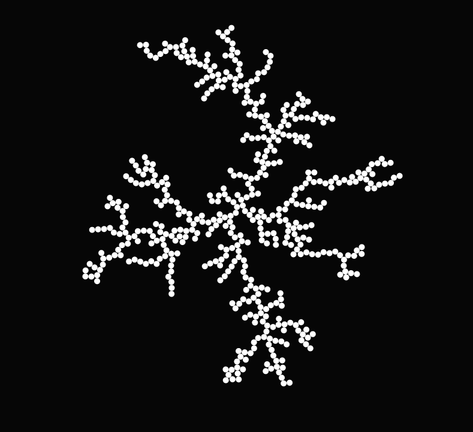

# Diffusion Limited Aggregation


Produces a mesmerizing structure, which is also called a [Brownian tree](https://rosettacode.org/wiki/Brownian_tree). You should be able to see it above.


Most of the implementations (e. g. in [Rosetta Code](https://rosettacode.org/wiki/Brownian_tree)) rely on a discrete grid and discrete movement of the particle. This implementation uses completely random movements. In case of an collision, the correct position is calculated.

**Note:** The script is - for now - pretty exhaustive. In case you want to add this to a website, you maybe should add sleeps at each particle step.

# Getting started
Download / clone the repository and start the `dla.html` in a browser of your choice.

# Structure
```
├── css
│   ├── bootstrap.min.css
│   └── dla.css
├── dla_500_example.png
├── dla.html
├── js
│   ├── dla.js
│   └── kd-tree.min.js
└── README.md
```
* `css`: Folder for stylesheets.
* `js`: Folder for JavaScript.
* `bootstrap.min.css`: Bootstrap framework.
* `dla_500_example.png`: Example for README.md.
* `dla.hml`: Main site displaying the Brownian tree.
* `dla.js`: Script for the Diffusion Limited Aggregation (DLA).
* `kd-tree.js`: KD-tree implementation to query neighbor points in an efficient manner.

**Have fun!**
