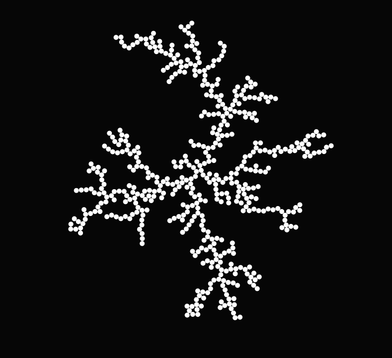

# Diffusion Limited Aggregation

Produces a mesmerizing structure, which is also called a [Brownian tree](https://rosettacode.org/wiki/Brownian_tree). You should be able to see it above.

Most of the implementations (e. g. in [Rosetta Code](https://rosettacode.org/wiki/Brownian_tree)) rely on a discrete grid and discrete movement of the particle. This implementation uses completely random movements. In case of an collision, the correct position is calculated.

# Getting started
Download / clone the repository and start the `dla.html` in a browser of your choice.

**Have fun!**
